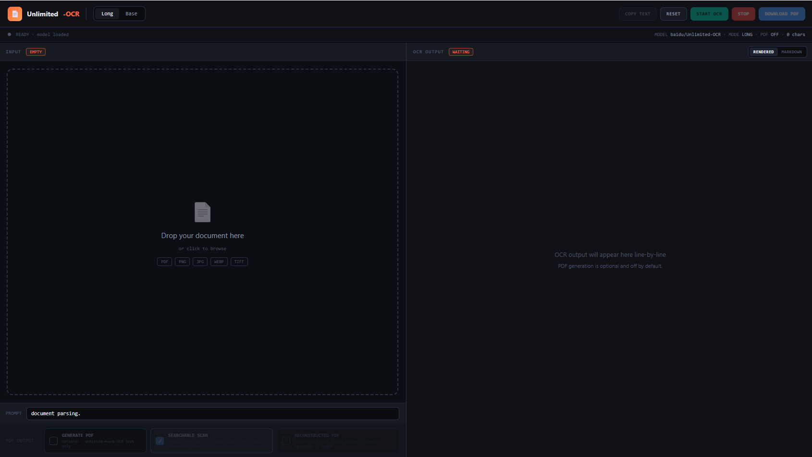
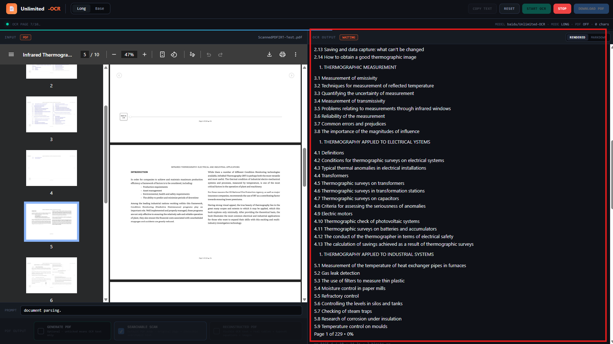
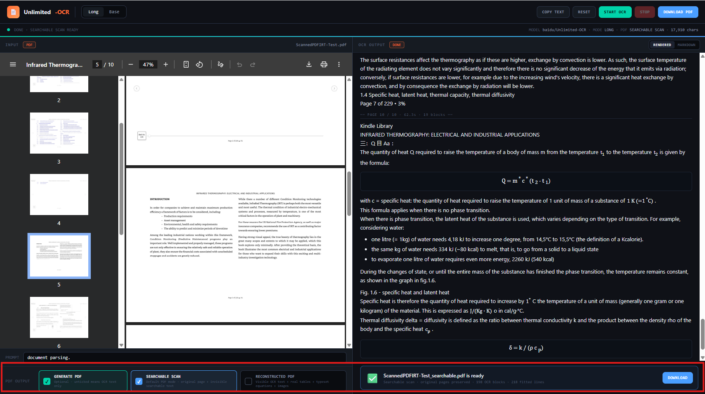

# Unlimited OCR – Searchable PDF for Pinokio

A local Pinokio app powered by **Baidu Unlimited-OCR** for OCR'ing images and PDFs, viewing OCR output live as rendered Markdown, and optionally generating searchable or reconstructed PDFs.

> **Page selection (v1.9.0):** For PDFs, OCR all pages or enter a page/range expression such as `7`, `3-12`, or `1-3, 7, 10-15`. Only selected pages are rasterized and sent to the model.


> **Graceful stop / partial export (v1.8.0):** During multi-page PDF OCR, pressing **STOP** finishes the current page, keeps every completed page result, and stops before the next page. Completed pages can then be exported as a partial Searchable Scan or Reconstructed PDF without rerunning OCR.

> **Table fidelity (v1.7.0):** Reconstructed PDF tables now use a **global auto-layout renderer** based on the stable v1.1 approach. The whole OCR table is laid out and scaled as one coherent HTML/vector object instead of solving every cell as an independent pixel-geometry problem. Text remains real/selectable PDF text, rules remain vector, `rowspan` / `colspan` and inline math cleanup are retained, and the source raster is used only for conservative global hints such as rule colour and an obviously coloured header row.

> **Independent community project.** This launcher is not affiliated with or endorsed by Baidu or Pinokio. The Unlimited-OCR model is downloaded separately from Hugging Face during installation.

## Features

- **Local OCR** using `baidu/Unlimited-OCR`.
- **Live line-by-line output** while each page is being generated.
- **PDF page/range selection** — OCR one page, a continuous range, or multiple ranges/pages; only selected pages are rasterized and processed.
- **Graceful STOP + partial PDF export** — finish the current page, keep completed pages, and export only those pages without rerunning OCR.
- **Rendered Markdown / raw Markdown toggle** in the Web UI.
- **Inline extracted figures/images** in the rendered OCR view for OCR-detected PDF visual regions.
- **Math rendering enhancements** including LaTeX `array` / `beginarray` structures and Greek alphabet commands.
- **PDF generation is opt-in** — OCR text-only is the default workflow.
- **Searchable Scan** is the default PDF option when PDF generation is enabled.
- **Existing-text preflight** tells you whether the PDF already contains usable searchable text before OCR starts.
- **Preserve or Replace** the existing PDF text layer when generating a Searchable Scan.
- **Reconstructed PDF** alternative with visible text, extracted images/figures, structured tables and common mathematical notation.
- **Original-page preservation** in Searchable Scan mode.
- **8 GB VRAM support through GPU + CPU offloading**.
- **Pinokio internal Web UI** — no separate Chrome/Edge tab is required.
- Local server binds to **`127.0.0.1`**.

## Screenshots

### Main OCR interface



### Rendered Markdown OCR



### Optional PDF generation



## PDF page selection

For a PDF, **All** pages are selected by default. Choose **Select** to OCR only part of the document. Supported examples:

- `7` — one page;
- `3-12` — one continuous range;
- `1-3, 7, 10-15` — mixed pages and ranges.

Selections are normalized, de-duplicated and processed in ascending source-page order. The app validates every page against the document page count before OCR begins. Crucially, unselected pages are not rasterized or sent to Unlimited-OCR, so selecting a subset saves both preprocessing and inference time.

If PDF generation is enabled, the output contains only the selected pages. Graceful STOP also works within a selection: if 8 pages were selected and 3 have completed, the partial export contains those 3 completed selected pages only.

See [`docs/PAGE_SELECTION.md`](docs/PAGE_SELECTION.md).

## Output modes

### OCR text only — default

Leave **Generate PDF** unticked. OCR text is streamed to the page as it is produced. The UI renders the Markdown by default, and the source can be viewed with the **MARKDOWN** toggle.

### Searchable Scan — default PDF mode

When **Generate PDF** is enabled, Searchable Scan is selected by default.

Before OCR starts, the app inspects the PDF's existing text layer and reports how many pages already contain usable searchable text.

For Searchable Scan, choose one of two policies:

- **Preserve Existing Text** (default/recommended): keep usable native PDF text and do not add a duplicate Unlimited-OCR layer on those pages. Pages without usable native text still receive the Unlimited-OCR layer.
- **Replace with Unlimited-OCR**: pages that contain an existing text layer are visually flattened first, removing the old searchable text, and the Unlimited-OCR detection text becomes the searchable layer. Pages with no existing text are kept as original PDF pages.

Preserve mode keeps original PDF pages visually intact. Replace mode necessarily rasterizes pages that contain old text so that the old searchable layer can be removed without making its visible text disappear; this can increase file size and removes vector/native-text properties on those replaced pages.

Best when **visual fidelity to the original scan matters most**, while still giving the user explicit control over pre-existing text.

### Reconstructed PDF

Creates a new born-digital PDF using visible OCR text and detected visual regions.

The reconstruction engine supports:

- visible text and headings;
- supported HTML/Markdown tables rendered as **one coherent global auto-layout PDF table** with real selectable text and vector rules;
- table columns, wrapping and row heights are solved globally to avoid the unstable large/small/duplicated cell text seen with per-cell pixel fitting on dense scans;
- source raster is used only for conservative global table styling such as rule colour and a clearly coloured first/header row;
- inline table-cell LaTeX such as `\lambda`, `^\circ`, superscripts/subscripts and Greek symbols is normalized to visible/selectable PDF text;
- negative exponents such as `C^{-1}` and `m^{-2}` are rendered as positioned PDF superscript text using ordinary `-` glyphs, avoiding missing-glyph squares on common Windows fonts;
- full local KaTeX rendering for LaTeX/math notation, including `\Rightarrow`, `\text{}`, arrays, matrices and aligned equations;
- figures, charts, diagrams and image regions cropped from the OCR page raster.

Best when **clean visible text and document reflow are more important than pixel-identical appearance**.

## Requirements

- Pinokio.
- NVIDIA CUDA-capable GPU.
- Internet connection for the one-time installation/model download.
- Sufficient disk space for the ~6.7 GB model plus Python/PyTorch environment and working files.

### Known working low-VRAM configuration

The launcher has been exercised successfully on an **NVIDIA GeForce RTX 3050 with 8 GB VRAM and 16 GB system RAM** using automatic GPU + CPU model offloading.

For lower offload overhead, 12 GB+ VRAM and additional system RAM are preferable. See [`docs/HARDWARE.md`](docs/HARDWARE.md).

## Install with Pinokio

### From a public Git repository

Once this source is published to GitHub, install the repository through Pinokio. Pinokio will use the launcher files at the repository root.

1. Open the app in Pinokio.
2. Click **Install**.
3. Wait for dependencies and the Unlimited-OCR model to download.
4. Confirm the install log reports `CUDA available: True`.
5. Click **Start**.
6. When loading finishes, click **Open Web UI**. The interface opens inside Pinokio.

### Local development folder

Copy the repository folder into Pinokio's `api` directory, refresh/restart Pinokio, then use **Install** and **Start** in the same way.

## Basic workflow

1. Upload an image or PDF.
2. For PDFs, wait briefly for the **Existing PDF Text** preflight summary.
3. Choose whether to enable **Generate PDF**.
4. If generating a Searchable Scan and existing text is detected, choose **Preserve Existing Text** or **Replace with Unlimited-OCR**.
5. Leave **Searchable Scan** selected or choose **Reconstructed PDF**.
6. Click **START OCR**.
7. Watch OCR text appear progressively in the output panel.
8. Switch between **RENDERED** and **MARKDOWN** at any time. In Rendered mode, detected figures are shown inline and supported math/arrays are typeset.
9. If PDF generation is enabled, download the generated PDF when processing finishes.

You can also enable PDF generation or switch PDF mode after OCR finishes; the cached OCR result can be reused without rerunning recognition.


### Stopping a long PDF job

For multi-page PDFs, **STOP** is intentionally page-safe rather than destructive. If you press STOP while page 17 of 80 is running, the app finishes page 17, saves pages 1–17, and does not start page 18.

- If **Generate PDF** is already enabled, the selected PDF mode is built automatically from pages 1–17.
- If **Generate PDF** is off, enable it after the stop to build from the cached pages without OCRing them again.
- Partial files are named clearly, for example `report_partial_17of80_searchable.pdf` or `report_partial_17of80_reconstructed.pdf`.
- The partial PDF contains only completed pages; unprocessed pages are not included.

## Installation details

`install.js`:

1. creates Pinokio's isolated `env`;
2. installs the application dependencies;
3. installs CUDA PyTorch / torchvision;
4. downloads `baidu/Unlimited-OCR` into `models/Unlimited-OCR`;
5. applies small local compatibility patches to the downloaded model source;
6. prints a CUDA/GPU verification summary.

The model is **not downloaded again on every Start**.

The pinned dependency versions intentionally stay close to Baidu's published Transformers inference stack. See the upstream project for its current reference environment:
https://github.com/baidu/Unlimited-OCR

## Repository layout

```text
.
├── app/
│   ├── app.py                 # FastAPI backend + OCR streaming
│   ├── index.html             # local Web UI
│   ├── searchable_pdf.py      # Searchable Scan builder
│   ├── pdf_text_analysis.py   # existing PDF text-layer preflight
│   ├── reconstructed_pdf.py   # reconstructed PDF builder
│   ├── model_patches.py       # local upstream compatibility patches
│   ├── download_model.py      # one-time Hugging Face model download
│   └── requirements.txt
├── docs/
├── licenses/
├── icon.png
├── install.js
├── start.js
├── pinokio.js
├── pinokio.json
├── LICENSE
├── THIRD_PARTY_NOTICES.md
├── CHANGELOG.md
└── VERSION
```

## Privacy and security

After installation, OCR is performed locally. User documents are not intentionally sent to a cloud OCR API. The server binds to `127.0.0.1` and has no authentication, so it should not be exposed directly to a network.

Temporary uploaded/generated files are stored under `work/`. See [`SECURITY.md`](SECURITY.md) for details.

## Limitations

- This launcher currently requires NVIDIA CUDA.
- Existing-text quality is determined by a conservative heuristic based on extractable words/characters and encoding cleanliness; the user remains in control of Preserve vs Replace.
- Replace Existing Text mode rasterizes pages that contain an old text layer; those pages no longer retain original vector text/graphics as vector objects.
- Unlimited-OCR's detection boxes are generally layout/block-level; Searchable Scan text selection may therefore be less word-precise than a word-level OCR engine even when search works correctly.
- Reconstructed PDF cannot recover the exact original font family, kerning or every layout property from a scan.
- The Web UI renders OCR-detected image/figure regions; a visual region the upstream model does not identify cannot be extracted automatically.
- Complex or malformed tables/equations may use a readable fallback. Table-cell styling is inferred from pixels and OCR markup, so unusual fonts/merged borderless layouts may still differ from the source.
- OCR accuracy remains dependent on the upstream model and source image quality.

## Model compatibility patches

For transparency, the launcher patches two behaviours in the locally downloaded remote-code model: explicit generation padding/masking and the deterministic vision `position_ids` buffer. Original downloaded source files are backed up before modification.

See [`docs/MODEL_PATCHES.md`](docs/MODEL_PATCHES.md).

## Troubleshooting

See [`docs/TROUBLESHOOTING.md`](docs/TROUBLESHOOTING.md).

## Sharing / Pinokio Discover

See [`docs/PUBLISHING_TO_PINOKIO.md`](docs/PUBLISHING_TO_PINOKIO.md) for a GitHub release checklist and Pinokio's current Discover submission process.

## License and attribution

The launcher/application code in this repository is released under the **MIT License**. See [`LICENSE`](LICENSE).

Baidu Unlimited-OCR is also MIT-licensed; the upstream copyright/license notice is preserved in [`licenses/BAIDU_UNLIMITED_OCR_LICENSE`](licenses/BAIDU_UNLIMITED_OCR_LICENSE). Model weights are downloaded separately and are not included in this repository.

Full third-party notices and the upstream paper citation are in [`THIRD_PARTY_NOTICES.md`](THIRD_PARTY_NOTICES.md).

### Local math rendering

The **RENDERED** OCR view uses a locally installed copy of **KaTeX 0.18.4**. This provides substantially broader LaTeX support than the earlier lightweight converter, including arrows, `\text{}`, Greek notation, fractions, roots, arrays, matrices, aligned equations, cases, sums and integrals. KaTeX is downloaded during Pinokio installation and served locally by the app; no CDN is required while processing documents. Malformed OCR math is conservatively repaired before rendering, with the previous lightweight converter retained as a fallback.

See [`docs/MATH_RENDERING.md`](docs/MATH_RENDERING.md).

